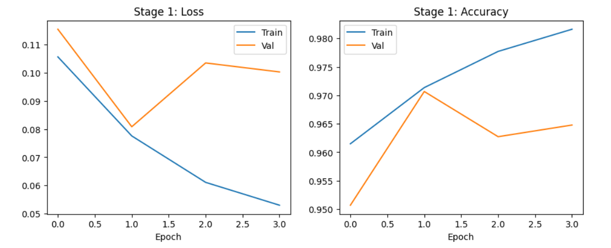
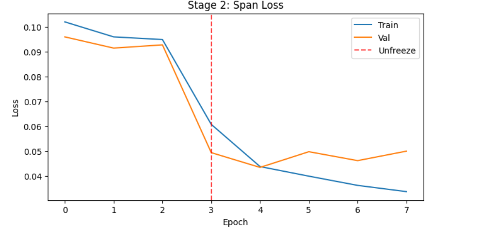

## Offensive-text-detection
In this project I aim to show:
1. How we can train a model that is able to accurately predict toxic texts as well as the spans of toxic parts in said text. (Code in `offensive_language.ipynb`)
2. How such a model could be utilized for moderation, specificaly, for a discord moderation bot. (Code in `run-bot.py`)

### Data
* **Toxicity detection**: For this task we used the dataset provided in the **jigsaw toxic comment classification challenge** on kaggle. The data was provided in train and test splits, thus I chose to not combine
the two, opting for a simple split of the train data to obtain the validation data. After the split and some extra proccessing of the test data we ended up with:\
&nbsp;&nbsp;&nbsp;&nbsp;train: 135635 samples\
&nbsp;&nbsp;&nbsp;&nbsp;val: 23936 samples\
&nbsp;&nbsp;&nbsp;&nbsp;test: 63978 samples
* **Toxic span deetction**: Here we use the **heegyu/toxic-spans** dataset which was used in **SemEval-2021 Task 5: Toxic Spans Detection**. Yet again the data is pre-split into train and test, so we just obtain
the validation set through the training data. After the split the results are as follows:\
&nbsp;&nbsp;&nbsp;&nbsp;train: 8505 samples\
&nbsp;&nbsp;&nbsp;&nbsp;val: 1501 samples\
&nbsp;&nbsp;&nbsp;&nbsp;test: 1000 samples

This large imbalance between the sizes of the datasets will shape how we later train the model.

### Model
For the model, I chose DeBERTa-v3-base as the backbone and added 2 heads, one for the classification of the text into toxic or non-toxic (clf head) and the other for the classification of each token into toxic or non-toxic (tok head).
I also used dropout and pooling where needed.

### Training 
For the training there were 3 options to combat the great difference in size between the two datasets:
1. Combine the data, train only once by using a loss function that accounts for both tasks but assigns a higher weight to the span data, in order to account for the lack of samples
2. Train the clf head + back bone on the jigsaw data -> freeze backbone and train the tok head on the span data for a few epochs, before unfreezing the backbone and ajusting its weights for a few epochs. This will
allow us to obtain good spans without destroying the already trained model.
3. Combine the 2 options above, by training jintly first and then fine tuning with extra training

All 3 options should work just fine for this task, however I opted for the 2nd as I felt it was easier to manage and overall more intuitive, while giving reasonable results. Below are the learning curves for both
training sessions:

During training (knowing that we will not need too many epochs beforehand) I chose to save the model weights at each epoch and later chose the one that seemed to work the best.

### Evaluation
During the evaluation I decided to find the best thresholds for both tasks, so that we will use them during inference and to evaluate our model's performance on all the test data. The evaluation yielded these results:\
* **Toxicity detection**:\
Accuracy:  0.8961\
Precision: 0.4822\
Recall:    0.8835\
F1-score:  0.6239\
ROC-AUC:   0.9537

* **Toxic span deetction**:\
Precision: 0.5010\
Recall:    0.6935\
F1-score:  0.5817

This shows that while our model doesn't reach the maximum performance in any of the two tasks, it can still work very well. (More careful fine tuning or a different method (1 or 3) could perhaps yield even better results!)

### Discord bot
For the discord bot I constructed a simple script that allows the bot to run on my discord server and detect toxic messages. Specifically it follows the following logic:
1. If the message is not toxic -> do nothing
2. if the message is toxic:
   1. If the spans list is not empty -> simply censor the toxic parts with '*'
   2. If the spans list is empty -> delete the message and inform the user via a dm
I also use a not so simple function `censor_toxic_spans`, so that only correct part is censored and so that the number of stars that appear match the number of letters in the censored word
Some examples:
1. Go to hell! -> Go to ****!
2. Go hang yourself! -> Go **** yourself!

### Final thoughts/Retrospective
As previously stated I believe that a better model can most certainly be derived through better tuning or by choosing a better, more complex method. Other than that I believe the model works pretty well and the discord bot helps highlight how such a model could be used in moderation throught many pieces of media, not just discord.

  
